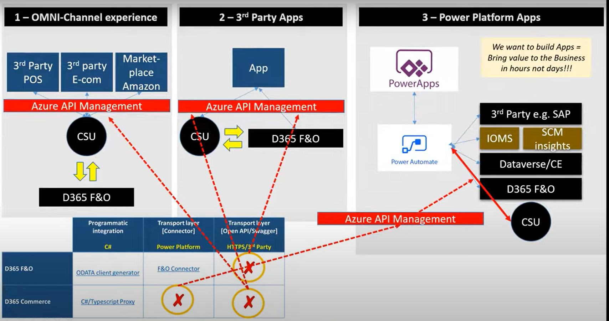

### D365F-O-Technical

# MorphX and Intellimorph

https://community.dynamics.com/blogs/post/?postid=748905e7-8caf-4cb7-97fe-3512f2067cb8#:~:text=MorphX%20is%20an%20integrated%20development,to%20use%20this%20MorphX%20IDE.

## Some Blogs Links

https://rockykatoch.wordpress.com/d365fo-interview-questions-answers/

https://14-dynamics365.com/2022/05/24/d365fo-interview-questions-and-answers-2022/

## Dynamics 365 Musings

https://dynamics365musings.com/

## Interview Q&A

# Links

https://14-dynamics365.com/2022/05/24/d365fo-interview-questions-and-answers-2022/

https://ashokkancheti.blogspot.com/2014/03/dynamics-ax-2012-interview-questions.html

https://docs.google.com/document/d/1egdDWYSY3l5B_NYOGDb-UuVnoR6v4q-9IQ0oi_-_1EY/edit#heading=h.1yifwsmtust9

### SSRS Report Generation

https://ax.docentric.com/create-a-new-custom-ssrs-report-in-d365fo/

## Types of Joins in D365 F&O

1)InnerJoin :: An Inner Join returns only the rows where there is a match in both tables based on the join condition.

2)OuterJoin :: An Outer Join returns all rows from both tables, along with matching rows from the tables if any, and null values for non-matching rows.

3)ExistJoin :: It seems like you might be referring to the EXISTS keyword used in SQL. EXISTS is a predicate used in a subquery to test for the existence of rows in a subquery result.

4)NonExitJoin :: There isn't a standard term called "NonExist Join." It might refer to a scenario where you want to retrieve rows from one table where corresponding rows do not exist in another table.

5)Active :: In a database context, "Active" could refer to a state where a database connection or transaction is currently processing or performing operations.

6)Passive :: "Passive" might refer to a state where a database connection or transaction is idle or not actively processing operations.

7)Delyed :: In some contexts, "Delayed" could refer to a feature or mechanism in a database system where certain operations are postponed or executed after a delay.

# There Are 5 different Types of Integration

1)Migration
2)Broadcast
3)Bi-directional sync
4)correlation
5)aggregation

### In Dynamics

# - Batch Integration

The current integration is designed to go through via an API that's developed on Microsoft's Azure's Logic Apps. The high level integration flow is as follows:

1. Generate file

2. POST the data by invoking a Logic Apps RESTful API endpoint.

3. Once the data is received in Logic Apps, the data is processed line by line into D365 FO.

The line by line processing into D365 seems somewhat inefficient, as the number of lines can be fairly large (between 300K - 500K). This could take a while.

Is this the best/recommended approach that Microsoft offers to integrate large subsets of data? Or are there other more "batch-oriented" patterns that can be recommended.

# - Real-Time Integration

https://www.youtube.com/watch?v=m3Rc92c906I

==> Use Odata Custom Service,Virtual Entities

### D365F&O Odata Integration

https://medium.com/@zia_ur_rahman_dynamics_geek/odata-in-d365-90a84f15751c

https://learn.microsoft.com/en-us/dynamics365/fin-ops-core/dev-itpro/data-entities/integration-overview

https://medium.com/@mateen462/integration-with-odata-d365f-o-and-net-12699f6fb7d1

https://learn.microsoft.com/en-us/dynamics365/fin-ops-core/dev-itpro/data-entities/odata

## Oauth 2.0

https://learn.microsoft.com/en-us/entra/identity-platform/v2-oauth2-auth-code-flow

## Videos On Integration

https://youtu.be/lFcblRQDeo4?si=d7GaVReNMe0--evj

### Steps To Install OData Client Code Generator to generate client-side proxy class

https://devblogs.microsoft.com/odata/tutorial-sample-how-to-use-odata-client-code-generator-to-generate-client-side-proxy-class/

## D365 F&O Integration with Service Now

https://www.servicenow.com/community/developer-blog/integrate-with-microsoft-dynamics/ba-p/2686446

## AAD(Azure Active Directory)

https://intellipaat.com/blog/azure-active-directory/

https://stackoverflow.com/questions/75751477/how-to-get-a-microsoft-azure-authorization-token

https://learn.microsoft.com/en-us/azure/active-directory-b2c/access-tokens

# What is data Entity

https://dynamics365musings.com/d365-data-entity/

https://dynamics365musings.com/create-a-d365-data-entity/
