### D365F-O-Technical

### Self Introduction for D365

A highly motivated Microsoft Dynamics AX/D365 Junior Technical Consultant with experience in ERP development, designing, implementing, modifying, troubleshooting, testing and debugging Microsoft Dynamics ERP software product using X++ programming language. Strong knowledge of SQL Server and SSRS Reports. Strong engineering professional with a Bachelor's degree. A collaborative person, passionate to learn and develop the latest skills.

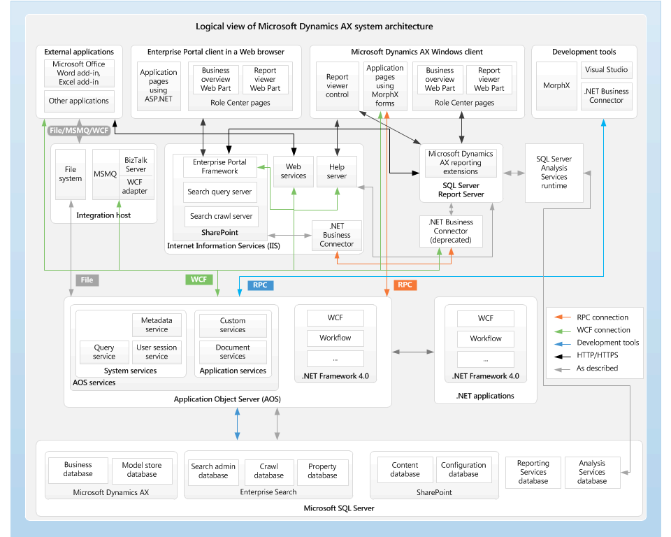

https://learn.microsoft.com/en-us/dynamicsax-2012/appuser-itpro/system-architecture

https://learn.microsoft.com/en-us/dynamicsax-2012/appuser-itpro/aos-architecture

## D365FO Interview Questions and Answers

### Table of Contents

| No. | Questions                                                                                                                                                                |
| --- | ------------------------------------------------------------------------------------------------------------------------------------------------------------------------ |
| 0   | [Projects in resume?](#projects-in-resume)                                                                                                                               |
| 1   | [What is Dynamics 365 F&O?](#what-is-dynamics-365-fo)                                                                                                                    |
| 2   | [What are OOPS concepts?](#what-are-oops-concepts)                                                                                                                       |
| 3   | [What is AOT in D365FO?](#what-is-aot-in-d365fo)                                                                                                                         |
| 4   | [Interfaces & Abstract Class](#interfaces--abstract-class)                                                                                                               |
| 5   | [What is the concept of extension in D365?](#what-is-the-concept-of-extension-in-d365)                                                                                   |
| 6   | [what-are-the-different-types-of-tables-used-in-d365-fo?](#what-are-the-different-types-of-tables-used-in-d365-fo)                                                       |
| 7   | [Difference Between TempDB and InMemory Tables?](#difference-between-tempdb-and-inmemory-tables)                                                                         |
| 8   | [what-is-edt-and-base-enum?](#what-is-edt-and-base-enum)                                                                                                                 |
| 9   | [what-is-an-index-in-d365-fo?](#what-is-an-index-in-d365-fo)                                                                                                             |
| 10  | [What are Delete Actions in D365 FO?](#what-are-delete-actions-in-d365-fo)                                                                                               |
| 11  | [difference-between-runbase-and-runbasebatch-class?](#difference-between-runbase-and-runbasebatch-class)                                                                 |
| 12  | [what-are-table-relations-in-d365?](#what-are-table-relations-in-d365)                                                                                                   |
| 13  | [what-are-different-type-of-menu-items-available-in-d365?](#what-are-different-type-of-menu-items-available-in-d365)                                                     |
| 14  | [dynamics-365-finance--operations--how-to-use-chain-of-command-in-x-coc?](#dynamics-365-finance--operations--how-to-use-chain-of-command-in-x-coc)                       |
| 15  | [what-is-the-sysoperation-framework-how-it-is-different-from-the-runbase-framework?](#what-is-the-sysoperation-framework-how-it-is-different-from-the-runbase-framework) |
| 16  | [what-is-lcs-lifecycle-service?](#what-is-lcs-lifecycle-service)                                                                                                         |
| 17  | [X++?](#X)                                                                                                                                                               |

1. ### What is Dynamics 365 F&O?

   Microsoft Dynamics 365 FO is a cloud based ERP (Enterprise Resource Planning) platform developed by Microsoft. Microsoft Dynamics 365 Finance & Operations has replaced the previous on premise version Dynamics AX 2012.

**[⬆ Back to Top](#table-of-contents)**

2. ### What are OOPS concepts?

   The main concepts of OOPS used in D365 FO are:

   1. Class and Objects
   2. Data Abstraction: Showing only the essential information and hide background details.
   3. Encapsulation: Wrapping of data member and method to a single unit.
   4. Inheritance:-The Flowing of property of parent class to the child class.
   5. Polymorphism:-The property of using the same method again and again to perform different things.

**[⬆ Back to Top](#table-of-contents)**

3. ### What is AOT in D365FO?

   The Application Object Tree (AOT) is a tree view of all the application objects in Microsoft Dynamics D365FO. The AOT contains every object you need to customize the look and functionality of a Dynamics D365FO application.

**[⬆ Back to Top](#table-of-contents)**

4. ### Interfaces & Abstract Class

   The class implementing is the interface that implements all interface methods and there will not be any abstract Class requirement. There are many access modifiers available like abstract, protected, virtual, internal, public, and many more that are useful in the abstract Classes. Abstract classes will be very fast when compared to interfaces.

   | Interfaces                                                                                                                               | Abstract Class                                                                                    |
   | ---------------------------------------------------------------------------------------------------------------------------------------- | ------------------------------------------------------------------------------------------------- |
   | The interface is the signature for a particular method.                                                                                  | Abstract class contains both the incomplete or complete methods .                                 |
   | Interface cannot be an implemented method                                                                                                | The abstract class is the implemented method.                                                     |
   | The interfaces does not contain constructors, fields, or destructors but they have only the property’s signature with no implementation. | The abstract class contains constructors, fields, or destructors for implementing the properties. |
   | Interface supports multiple inheritances.                                                                                                | The abstract class does not support multiple inheritances.                                        |
   | The class can also inherit more than one interfaces.                                                                                     | The class can inherit only one abstract class.                                                    |

**[⬆ Back to Top](#table-of-contents)**

5. ### What is the concept of extension in D365?
   An extension is a way to add new functionality to an existing object in D365FO without modifying the base code of that object. Microsoft has added the concept of extension because they don’t want to modify the code base anymore. In this way, it will be easier to upgrade the application code base in the future by Microsoft.

**[⬆ Back to Top](#table-of-contents)**

6. ### What are the different types of Tables used in D365 FO?

   There are 3 types of tables used in D365 FO :

   1. Regular
   2. Temp DB
   3. In Memory

**[⬆ Back to Top](#table-of-contents)**

7.  ### Difference Between TempDB and InMemory Tables?

    There are two types of temporary tables in Dynamics 365 F&O, TempDB tables, and InMemory tables. The differences between them are described in the following grid:

    | sNo | InMemory tables                                     | TempDB tables                                                   |
    | --- | --------------------------------------------------- | --------------------------------------------------------------- |
    | 1   | Holds data temporarily in the client or server tier | Holds data temporarily in the database until the scope is valid |
    | 2   | These tables can’t be stored in Database            | These tables are stored in the database                         |
    | 3   | Can’t apply security                                | Can apply security                                              |
    | 4   | We cannot use InMemory table buffers                | TempDB table buffer can be used in coding                       |

    ### TempDB tables

    We call them TempDB tables because their TableType property value is TempDB. This value comes from the TableType::TempDB enum value. The TableType property value can be set at AOT > Data Dictionary > Tables > MyTempDBTable > Properties > TableType.
    All types of temporary tables are automatically dropped by the system when the table variable in X++ goes out of scope. A TempDB table is NOT dropped when you set its record buffer variable to null.

    ### Capabilities of TempDB Tables:

    1. Can be joined with other AX tables
    2. Can be either per company or global.
    3. Can have foreign key columns.
    4. TempDB tables can be instantiated from the client or server tier.
    5. Can have indexes columns.
    6. Can have methods, but cannot override them.
    7. Usable as a query
    8. No configuration key is required.

    ### Limitations of TempDB Tables:

    1. Cannot be a valid time state table.
    2. Cannot have any delete actions.
    3. No Record Level Security (RLS).
    4. Cannot use the Table browser form.
    5. Cannot be in a table collection.
    6. No view support.

    ### The lifetime of TempDB Tables:

    A TempDB table is instantiated in the underlying database management system when the first SQL operation is sent to the database system from the AOS. (select, insert, update, or delete)

    The situations that cause a TempDB table to be dropped are:

    1. Variable goes out of scope.
    2. A controlled restart of the AOS.
    3. A restart of the database system.
    4. Closure of the AX32.exe client.
    5. From Online Users form.

    ### InMemory tables

    The second type of temporary table is the InMemory table. We call them InMemory tables because their TableType property value is InMemory. This value comes from the TableType::InMemory enum value. The TableType property value can be seen at AOT > Data Dictionary > Tables > MyInMemoryTable > Properties > TableType.

    Note: In Microsoft Dynamics AX 2009 and earlier versions, InMemory tables were called temporary tables. Now there are two kinds of temporary tables, namely InMemory tables and TempDB tables. To avoid confusion we do not use the phrase temporary tables to refer to just InMemory tables or to just TempDB tables.

    Tier: InMemory tables are instantiated in the active memory of whichever tier the process is running on, either the client or the server tier. InMemory tables are never represented in the database management system.
    An InMemory table is held in memory until its size reaches 128 KB. The dataset is then written to a disk file on the server tier.

    Scope: An InMemory table is instantiated when the first record is inserted. The instantiated InMemory table continues to exist only while a record buffer variable that references the table exists. The memory or disk space for the InMemory table is de-allocated as soon as the record buffer goes out of scope.

    Indexes: can be defined on an InMemory table just as you would a persisted table. If an InMemory table is created by copying a persisted table, the indexes are also copied to the InMemory table. Indexes are useful for quickly retrieving data from InMemory tables, especially if the InMemory table data is in a disk file.

**[⬆ Back to Top](#table-of-contents)**

8. ### What is EDT and Base Enum?

   EDT or Extended Data Type and Base Enumerations (Enums) are data types. They are created and managed in the development environment. Extended data types can be primitive data types like integers, strings, real numbers, and booleans. EDT extends the original properties of the data type which they inherit. In addition, some extra properties are added.

   Base enums are a fixed set of values. Those values in database are saved as intigers but they have also name (as referenced from X++ code) and a label (visible to users). You can have up to 255 values for Base enums. The integers in the database will take on the values 0 through 254.

   The AOT in D365FO apps contains many existing EDTs and base enums that can be extended for use in your project, or you can create new data types.

### How to create Extended Data Types – Microsoft Dynamics AX

#### What is an Extended Data Type?

Extended Data Types are commonly mentioned as EDTs. They extend base types, such as
Strings, and Integers, by adding properties that affect the looks, behavior, data
(size), and table reference/relationships. This means we can have types like Customer
account that has a label, size, table relation information, and other properties that provide
consistency and greater understanding within the data model.
Another example of an EDT is Name. Should we change the StringSize property of this
field, all fields extends this EDT are going to be adjusted; and if we reduce string size, it’ll truncate
the values to the new size.
All fields should extend an EDT or an Enum.

##### How to create Extended Data Type?

We will create an EDT for the Vehicle number. A vehicle table is a similar pattern to
customers, and vendors, and we will extend the AccountNum Extended Data Type.
To create the EDT, follow these steps:

1. EDT is created like all new AX artifacts, by pressing
   Control+Shift+A or right-clicking on a folder in the solution explorer and choose Add | New Item.
2. Select EDT String as Data Type.
3. In the Name field, enter ConVehicleId and press Add.
4. Next we need to complete the property sheet, the main properties are covered in
   the following table.
5. If this EDT is to be used as a primary key field, we need to populate the Table References.
6. Press save or save all in the toolbar to save the changes.
   Property Value
   Label Vehicle Id
   Help Text The Vehicle Number
   Extends AccountNum

   ##### Using of EDT

   There is a back and forth element to EDT creation, when we are creating a primary key
   field. We can’t create the field without the EDT, yet we can’t complete the EDT with the
   field being on the table.
   EDTs are types. They must therefore be globally unique amongst all other types, such as
   tables, views, data entities, enums, classes and other EDTs. The EDT’s properties aren’t just
   defaults, but they control behavior too. Should we add an unbound control to a form based
   on an EDT, the EDT can use the Table Reference property to provide a drop down list,
   and the contents will be taken from a field group on the table.

   EDTs can also extend other EDTs, although these child EDTs can only affect appearance
   properties. This is useful when we want to enforce physical storage attributes of a range of
   types, but have a different label depending on context. If we change the size of a base EDT,
   all EDTs that extend it will be affected and consequently all of the fields that are based on
   them.
   We often extend specific EDTs, when creating an EDT for certain types of fields

**[⬆ Back to Top](#table-of-contents)**

9. ### What is an index in D365 FO?

   An index is a table-specific database structure that speeds the retrieval of rows from a table. Indexes are used to improve the performance of data retrieval and occasionally to ensure the existence of unique records.

   There are two types of indexes unique and non-unique. Whether an index is unique is defined by the index’s AllowDuplicates property. When this property is set to No, a unique index is created. The database uses the unique index to ensure that no duplicate key values occur. The database prevents you from inserting records with duplicate key values by rejecting the insert.

**[⬆ Back to Top](#table-of-contents)**

10. ### What are Delete Actions in D365 FO?

##### Deleted Actions/ OnDelete with Example – Microsoft Dynamics 365 F&O

Delete Actions and OnDelete property indicates how deletions in the main table are handled in the related tables or child tables. There are 3 types of options are available i.e. Cascade, Restricted & CascadeRestricted.

The delete action and OnDelete property (available only for Microsoft D365 finance and operations) help to maintain database consistency.

Before the release of Microsoft Dynamics 365 for operations , in Microsoft Dynamics AX , there was only one option available i.e Delete Actions.

But in Microsoft Dynamics 365 finance and operations we have 2 options available. The first one is the traditional approach which was also available in Microsoft Dynamics AX i.e. Delete Actions. The second one is a new approach and recommended in Microsoft Dynamics 365 for finance and operations. This include defining “On Delete” property Below will show some example how to create delete actions using OnDelete properties:

1.Create 2 tables, parent table and child table.

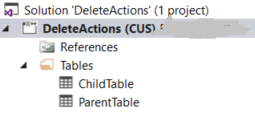

2.Add fields in Parent table and Child table, In our case: Id is primary key on parent table and ParentId is foreign key in Child tabe.

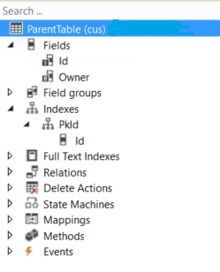

3.Create a primary key for Parent table, For this create a Index and set Alternative key true and Allow duplicate set to no.

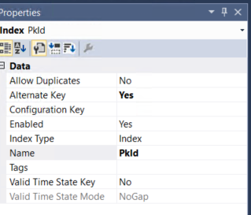

4. Now expand relationship node of child table and right click than add foreign key relation

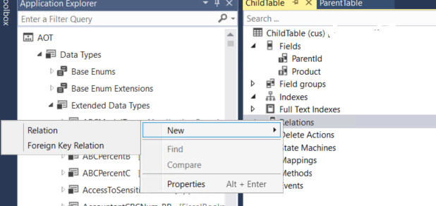

In the On Delete property we chose Delete Action Type (In our case Cascade)

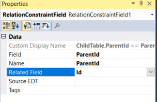

Now we can fill our tables with some test Data

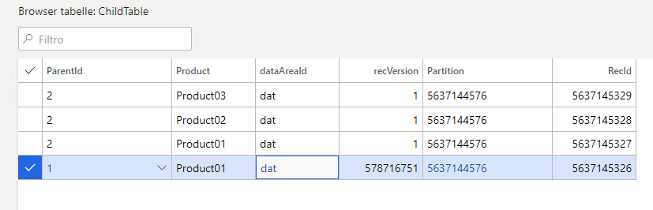

If we delete Owner2 in Parent table, the related record in child table will be deleted automatically.

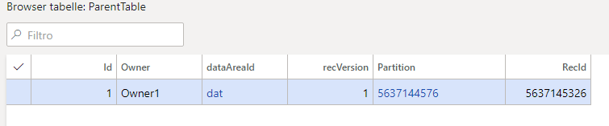

#### Delete Actions Types

First type and option is CASCADE. For example : If you have one parent table ParentTable and you have one child or related table ChildTable . If you are going to use CASCADE delete action or On delete property then on deletion of records in TABLE ParentTable , related records in TABLE ChildTable will also get deleted. (OurCase)

Second type and option is RESTRICTED. For example : If you have one parent table ParentTable and you have one child or related table ChildTable. If you are going to use RESTRICTED delete action or On delete property then on deletion of record in TABLE ParentTable , system will not validate records in related Table ChildTable. If related record exits in Table ChildTable then system will not allow you to delete record in Table ParentTable and throw an error.

Second type and option is CASCADE RESTRICTED. For example : if we have 3 tables i.e. parent table Vehicle & related tables Car & CarManufacturer. Table CarManufacturer is child or related table of Table CAR and similarly Table CAR is child or related table of parent Table Vehicle. If we will set the delete action CASCADE in between Parent Table Vehicle and Related Table CAR and again if we will set the delete action CASCADE RESTRICTED in between Table CAR and Related Table CarManufacturer. Then on deletion of record in Parent TABLE VEHICLE, system will also delete all the related records of TABLE CAR & CarManufacturer. But if you will try to delete records in Car and related records exists in Table CarManufacturer then system will not allow to delete records.

**[⬆ Back to Top](#table-of-contents)**

11. ### Difference between RunBase and RunBaseBatch class.

##### Difference between RunBase and RunBaseBatch class – AX 2012 Or Dynamics 365 F&O

RunBase: To create a job or an Action class – a program that carries out processes, such as accepting parameters from the user and then updating records in the database – you use the RunBase framework.

The framework is implemented by the RunBase application class and supplies many features, which include the following:

· Query

· dialog, with the persistence of the last values entered by the user

· Validate

The RunBase application framework runs or batches an operation.

An operation is a unit of work, such as the posting of a sales order or calculation of a master schedule.

The RunBase framework uses the Dialog framework to prompt a user for data input.

It uses the SysLastValue framework to persist usage data and the Operation Progress framework to show operation progress.

The RunBase class is a framework for classes that need a dialog for user interaction and that need the dialog values to be saved per user.

RunBaseBatch: You can design your own batch job by extending the RunBaseBatch class. You can also write code to schedule the batch to run. The batch runs on the Application Object Server (AOS)

RunBaseBatch is an extension of RunBase – it adds a support for batch processing.

SysOperation framework is a newer framework replacing RunBase (and its extensions such as RunBaseBatch).

##### Create a Runbase batch class

Recently got a requirement to create a run base batch for posting inventory journals.So, I created below class.

Please change the code according to your requirement.

Step 1 – Copy and paste the below code in a new class
Step 2 – Create a new action button and attach the class to it.
Step 3 – Add the action button to a module. In my case I added it to the Inventory Management -> Periodic area.

        /// Created this class for posting open inventory journals

        class InventoryJournalsPostings extends RunBaseBatch
        {
        QueryRun gQueryRun;
        #define.CurrentVersion(1)

            /// 

            /// Construct the class
            /// 

            /// <returns>Return the class object</returns>
            public server static InventoryJournalsPostings construct()
            {
                return new InventoryJournalsPostings();
            }

            /// 

            /// 

            /// <returns>Return the class desc</returns>
            public client server static ClassDescription description()
            {
                return "Inventory Journals Posting";
            }

            /// 

            /// 

            /// <returns>Whether the class can be used in a batch task</returns>
            protected boolean canGoBatchJournal()
            {
                return true;
            }

            /// 

            /// <returns></returns>
            public container pack()
            {
                container pack = conNull();

                if (gQueryRun)
                {
                    pack = gQueryRun.pack();
                }
                return [#CurrentVersion] + [pack];
            }

            /// 

            /// 

            /// <param name = "packedClass"></param>
            /// <returns></returns>
            public boolean unpack(container _packedClass)
            {
                boolean     ret         = false;
                int         version     = RunBase::getVersion(_packedClass);
                container   packedQuery = conNull();

                switch (version)
                {
                    case #CurrentVersion:
                        [version, packedQuery] = _packedClass;

                        if (SysQuery::isPackedOk(packedQuery))
                        {
                            gQueryRun   = new QueryRun(packedQuery);
                            ret         = true;
                        }
                        break;

                    default:
                        ret = false;
                }
                return ret;
            }

            /// 

            /// Allows the class go batch
            /// 

            /// <returns>Return the result</returns>
            public boolean canGoBatch()
            {
                return true;
            }

            /// 

            /// 

            /// <returns>Return the true result</returns>
            public boolean runsImpersonated()
            {
                return true;
            }

            /// 

            /// Doesn't allows the class run in the new session
            /// 

            /// <returns>Return the result</returns>
            protected boolean canRunInNewSession()
            {
                return true;
            }

            /// 

            /// 

            /// <returns></returns>
            public boolean showQueryValues()
            {
                return true;
            }

            /// 

            /// 

            /// <returns></returns>
            public QueryRun queryRun()
            {
                return gQueryRun;
            }

            /// 

            /// 

            public void initQueryRun()
            {
                Query                               query = new Query();
                QueryBuildDataSource                inventJournalTableDS;
                QueryBuildRange                     inventJournalStatus;
                QueryBuildRange                     inventJournalStatusRange;

                inventJournalTableDS                      = query.addDataSource(tableNum(InventJournalTable));
                inventJournalStatus                       = inventJournalTableDS.addRange(fieldNum(InventJournalTable, Posted));

                inventJournalStatus                       = inventJournalTableDS.addRange(fieldNum(InventJournalTable, JournalId));

                gQueryRun = new QueryRun(query);
                gQueryRun.saveUserSetup(true);
            }

            /// 

            /// 

            /// <param name = "_args">The specified arguments</param>
            public static void main(Args _args)
            {
                InventoryJournalsPostings    InventoryJournalsPostings = InventoryJournalsPostings::construct();

                InventoryJournalsPostings.getLast();
                InventoryJournalsPostings.caption();
                InventoryJournalsPostings.initQueryRun();

                if (InventoryJournalsPostings.prompt())
                {
                    InventoryJournalsPostings.run();
                }
            }

            /// 

            /// Post open inventory journals
            /// 

            public void run()
            {
                InventJournalTable              inventJournalTable;

                //Query query = gQueryRun.query();

        while (gQueryRun.next())
        {
        inventJournalTable = gQueryRun.get(tableNum(inventJournalTable));

                    if (inventJournalTable.Posted == NoYes::No)
                    {
                        JournalCheckPost                journalCheckPost;
                        journalCheckPost = InventJournalCheckPost::newPostJournal(inventJournalTable);
                        try
                        {
                            ttsbegin;
                            if(journalCheckPost.validate())
                            {
                                journalCheckPost.run();
                            }
                            ttscommit;
                        }
                        catch
                    {
                        info(infolog.text());
                    }
                    }
                }
            }

        }

**[⬆ Back to Top](#table-of-contents)**

12. ### What are Table Relations in D365?

    A table relation associates two tables that contain related information. Usually the primary key field of one table appears as a foreign key field of the related table. The table with the primary key is called the parent table. The table with the foreign key is called the child table.

    In Microsoft Dynamics 365 there are :

    . Normal Relation
    . Field Fixed Relation
    . Related Field Fixed Relation
    . Foreign Key Relation

    A normal relation is used to specify a relation without any conditions. A normal relation specifies related fields in another table. Multiple fields can also be added in normal relations.

    Condition is , Table1.Field = Table2.Field

    A Field Fixed Relation is used to specify relation fields to restrict the records in the primary table. Only records that meet the condition are selected. The field fixed is normally an enum.

    The condition is ANDed with your relation here Table.Field = <EnumValue>

    A Related Field Fixed Relation is used to specify relation fields to restrict the records in the related table. Only records that meet the condition are selected.The Related field fixed is normally an enum.

    The condition is ANDed with your relation here, <EnumValue> = Table.Field

    A Foreign Key Relation is used to specify a correspondence between a foreign key field in the present table to the primary key field in another parent table.

**[⬆ Back to Top](#table-of-contents)**

13. ### What are different type of Menu Items available in D365?

    There are three types of menu items in D365 FO:

    Display Menu Item: Use this type when the menu item will open a form.

    Output Menu Item: Use this type when the menu item will opening an SSRS report.

    Action Menu Item: Use this type when the menu item will run a batch job. Or some other process, such as run by a class.

**[⬆ Back to Top](#table-of-contents)**

14. #### Dynamics 365 Finance & Operations – How to use chain of command in X++ (CoC)

Chain of Command (CoC) enables strongly typed extension capabilities of public and protected methods. It is an amazing piece of development capability that allows technical consultants to extend the application avoiding over-layering.

Microsoft has implemented chain of command across Classes, Tables, Forms, form data sources, and data field methods.

Before we dive into the Chain of Command methods, remember that in order to use CoC you must declare your class as final, and your methods should always contain the next keyword.

The next keyword behaves like a super, and it will define when your extended logic executes. The next call after your code behaves like a Pre-event handler, your logic executes first, and later on, the logic residing in the original method gets executed. The next call before your code behaves like a Post event handler, your logic executes after the code residing in the original method gets executed.

### How to use chain of command to extend the class method

In the below screenshot, I am using method wrapping or class extension of standard class:

1. We need to check if the method that we want to extend is public or protected, in our example modifyVoucherDate is public.

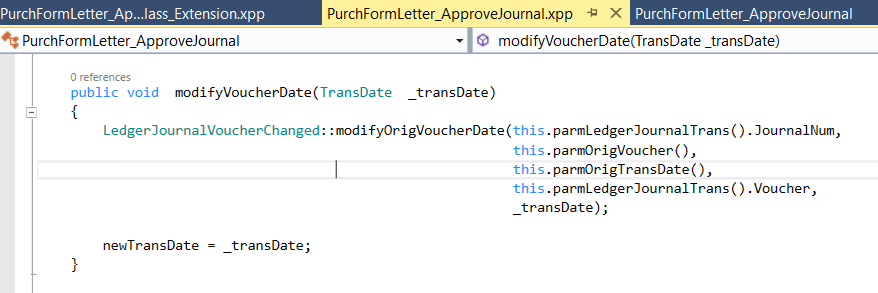

2. Create a final class that extends the PurchFormLetter_ApproveJournal class.

3. If we want to customize the process before the modifyVoucherDate method is executed, write our code before the next keyword, otherwise after the next keyword.

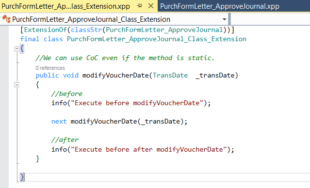

We can use chain of command in tables, forms, form data source, etc in the same way as we use it for a class method, the only thing that changes is the keyword inside ExtensionOf.

Below you can find the different keywords you need to use in each case:

. [ExtensionOf(classStr(PurchFormLetter_ApproveJournal))] – class extension
. [ExtensionOf(tableStr(tableName))] – table extension
. [ExtensionOf(formStr(FormName)] – form extension
. [ExtensionOf(formdatasourceStr(FormName,dataSourceName)] – form data source extension
. [ExtensionOf(formControlStr(FormName,controlName)] – form control extension

### Benefits Of Using Change Of Commands instead of Old Overlayering approach in Microsoft Dynamics 365 Finance and Operations

1. Easy Future upgrades and version enhancements as you are not overlaying in standard classes or methods or objects & keeping you separate extension classes.
2. Neat & Clean development as no need to compile the whole code library.
3. Support and the maintenance of the code will be easier in the future.
   I hope this article provided some light on the upcoming changes in Chain of Command for D365 for Finance and Operations Fall Release.

To wrap up, let’s review some of the requirements and considerations while writing CoC methods on form nested concepts extensions:

1. As with any other CoC method, these ones need to call always next to invoke the next in the chain, so it can go all the way to the kernel / native implementation in the runtime behavior. This is equivalent to calling super( ) from the form itself to guarantee the base behavior in the runtime is always executed as expected.
2. It is NOT possible to add CoC to wrap methods that are not defined in the original base behavior of the nested control type. However, it is possible from the control extension to make a call into this method if it has been defined as public or protected.
3. It is NOT needed to recompile the module where the original form is defined to have support for CoC methods on nested concepts on that form from an extension.

**[⬆ Back to Top](#table-of-contents)**

15. ### What is the Sysoperation framework how it is different from the runbase framework?

In Microsoft Dynamics AX 2012 & D365FO, the SysOperation system supplanted the RunBase system to bolster the group preparing usefulness. Going forward, the SysOperation system is prescribed for composing custom trade rationale that requires clump handling usefulness, over the censured RunBase framework. The RunBase system characterizes coding designs that actualize these necessities. The SysOperation system gives base executions for numerous of the designs characterized by the RunBase system. Another incredible thing is SysOperation system streamlined the pack / unload of factors that were extra work within the RunBase system, taking advantage of the Traits highlight presented with AX 2012 & D365FO.

SysOperation framework allows application logic to be written in a way that supports running operations interactively or via the Microsoft Dynamics AX & D365FO batch server. It implements the MVC (Model–View–Controller) design pattern, with the isolation of Parameters (Model), Dialog (View), and Service (Controller), for the code that’s executed.

The key objects of the framework are defined below:

###### Service:

The service class extends from the SysOperationServiceBase class and contains the business logic for the batch operation. Developers often tend to add the business logic in controller classes, which violates the Single responsibility principle.

###### Data Contract:

Data contract class is the model class defining attributes needed for batch operations. These attributes are provided by the user, in a dialog. DataContractAttribute attribute is needed for the class and the properties methods require the DataMemberAttribute attribute.

###### Controller:

Controller class extends from the SysOperationServiceController class. It holds information about the batch operation like execution mode, show dialog or progress bar etc. and directs the batch operation.

###### UI Builder:

UI Builder class extends from SysOperationAutomaticUIBuilder class and is used for adding custom behavior to dialog/dialog fields dynamically constructed by the SysOperation framework.

https://medium.com/@sakthivelssvj/sysoperation-framework-in-d365-da68a57955af#:~:text=in%20the%20background.-,The%20SysOperation%20Framework%20can%20help%20you%20create%20batch%20jobs%20that,users%20when%20they%20need%20them.

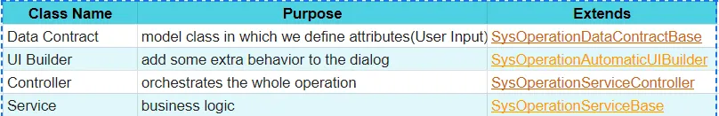

**[⬆ Back to Top](#table-of-contents)**

16. ### what is LCS (Lifecycle service)?

Lifecycle Services (LCS) for Microsoft Dynamics is a collaboration portal that provides an environment and a set of regularly updated services that can help you manage the application lifecycle of your implementations of finance and operations apps.

**[⬆ Back to Top](#table-of-contents)**

17. ### X++?

X++ is indeed a compiled language. In the context of Microsoft Dynamics AX (now Dynamics 365 Finance and Operations), X++ code is compiled into Intermediate Language (IL) code, which is then executed by the Common Language Runtime (CLR) within the Dynamics AX runtime environment. The X++ compiler translates the human-readable X++ code into a format that can be understood and executed by the underlying runtime environment. This compilation process helps ensure efficiency and performance when running Dynamics AX applications.

**[⬆ Back to Top](#table-of-contents)**

###

# Create deployable packages of models

https://learn.microsoft.com/en-us/dynamics365/fin-ops-core/dev-itpro/deployment/create-apply-deployable-package

# MorphX and Intellimorph

https://community.dynamics.com/blogs/post/?postid=748905e7-8caf-4cb7-97fe-3512f2067cb8#:~:text=MorphX%20is%20an%20integrated%20development,to%20use%20this%20MorphX%20IDE.

## Some Blogs Links

https://rockykatoch.wordpress.com/d365fo-interview-questions-answers/

https://14-dynamics365.com/2022/05/24/d365fo-interview-questions-and-answers-2022/

## Dynamics 365 Musings

https://dynamics365musings.com/

## Interview Q&A

# Links

https://14-dynamics365.com/2022/05/24/d365fo-interview-questions-and-answers-2022/

https://ashokkancheti.blogspot.com/2014/03/dynamics-ax-2012-interview-questions.html

https://docs.google.com/document/d/1egdDWYSY3l5B_NYOGDb-UuVnoR6v4q-9IQ0oi_-_1EY/edit#heading=h.1yifwsmtust9

### SSRS Report Generation

https://ax.docentric.com/create-a-new-custom-ssrs-report-in-d365fo/

## Types of Joins in D365 F&O

1)InnerJoin :: An Inner Join returns only the rows where there is a match in both tables based on the join condition.

2)OuterJoin :: An Outer Join returns all rows from both tables, along with matching rows from the tables if any, and null values for non-matching rows.

3)ExistJoin :: It seems like you might be referring to the EXISTS keyword used in SQL. EXISTS is a predicate used in a subquery to test for the existence of rows in a subquery result.

4)NonExitJoin :: There isn't a standard term called "NonExist Join." It might refer to a scenario where you want to retrieve rows from one table where corresponding rows do not exist in another table.

5)Active :: In a database context, "Active" could refer to a state where a database connection or transaction is currently processing or performing operations.

6)Passive :: "Passive" might refer to a state where a database connection or transaction is idle or not actively processing operations.

7)Delyed :: In some contexts, "Delayed" could refer to a feature or mechanism in a database system where certain operations are postponed or executed after a delay.

# There Are 5 different Types of Integration

1)Migration
2)Broadcast
3)Bi-directional sync
4)correlation
5)aggregation

### In Dynamics

# - Batch Integration

The current integration is designed to go through via an API that's developed on Microsoft's Azure's Logic Apps. The high level integration flow is as follows:

1. Generate file

2. POST the data by invoking a Logic Apps RESTful API endpoint.

3. Once the data is received in Logic Apps, the data is processed line by line into D365 FO.

The line by line processing into D365 seems somewhat inefficient, as the number of lines can be fairly large (between 300K - 500K). This could take a while.

Is this the best/recommended approach that Microsoft offers to integrate large subsets of data? Or are there other more "batch-oriented" patterns that can be recommended.

# - Real-Time Integration

https://www.youtube.com/watch?v=m3Rc92c906I

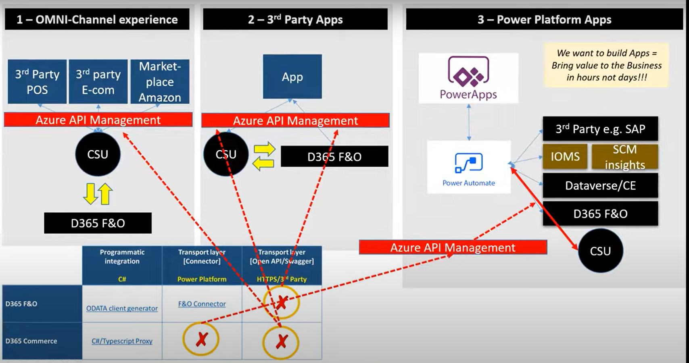

==> Use Odata Custom Service,Virtual Entities

### D365F&O Odata Integration

https://medium.com/@zia_ur_rahman_dynamics_geek/odata-in-d365-90a84f15751c

https://learn.microsoft.com/en-us/dynamics365/fin-ops-core/dev-itpro/data-entities/integration-overview

https://medium.com/@mateen462/integration-with-odata-d365f-o-and-net-12699f6fb7d1

https://learn.microsoft.com/en-us/dynamics365/fin-ops-core/dev-itpro/data-entities/odata

## Oauth 2.0

https://learn.microsoft.com/en-us/entra/identity-platform/v2-oauth2-auth-code-flow

## Videos On Integration

https://youtu.be/lFcblRQDeo4?si=d7GaVReNMe0--evj

### Steps To Install OData Client Code Generator to generate client-side proxy class

https://devblogs.microsoft.com/odata/tutorial-sample-how-to-use-odata-client-code-generator-to-generate-client-side-proxy-class/

## D365 F&O Integration with Service Now

https://www.servicenow.com/community/developer-blog/integrate-with-microsoft-dynamics/ba-p/2686446

## AAD(Azure Active Directory)

https://intellipaat.com/blog/azure-active-directory/

https://stackoverflow.com/questions/75751477/how-to-get-a-microsoft-azure-authorization-token

https://learn.microsoft.com/en-us/azure/active-directory-b2c/access-tokens

# What is data Entity

https://dynamics365musings.com/d365-data-entity/

https://dynamics365musings.com/create-a-d365-data-entity/

# FORMS

Form level logic>>

1. form level methods

2. data source level methods

3. data source field level menthods

4. design control level methods

Form creation > menu item > adding meni item in menus

Display MenuItem > form I

Action MenuItem > class

output menuitem > report

#### Form

Form creation > menu item > adding meni item in menus

Display MenuItem > form

Action MenuItem > class

output menuitem > report

# Form method calling sequence

#### form opening

form level > init() >> from DataSource > init()

form level >run() >> from DataSource > executeQuery()

from DataSource > active()

form level > closed()

#### form closing

form level > canClose()

form level > CLose()

form level > Closed()

#### I creating new record in form level

from DataSource > create()

from Datasource > initValue() >> table level >> initvalue()

from DataSource > active()

#### saving record in form level

from DataSource> validatewrite() >>> table level >> validatewrite()

from DataSource > write() >>> table level >> insert()

from DataSource > active()

# Create A New NumberSequence

it will generate new id when we click on a new button

1. Edt string

every module has one num seq class

2. loadModue() to load edt

every module has one parameter table

3. this table is used for setups

4. need create reference

need to run job for number sequence

5. functional setups,

6. need to write logic in table initvalue()

7. ### Projects in resume

1) ##### CIC (The Co-operative Insurance Company of Kenya Limited (CIC Insurance)) formerly known as Co-operative Insurance Services Limited
   kenya,uganda,South Sudan,Malawi

1. Individual

   1. Easy bima
   2. Motor Commercial
   3. Home Insurance
   4. senior Mediplan
   5. personal Accident

2. Business
   1. motor commercial
   2. motor private
   3. Fire Insurance
   4. theft
3. corporates
4. Cooperative

5. ##### PIPL (Pacific International Pvt Ltd based in India)

Pacific International Pvt Ltd based in India, providing industrial solutions and services to Iron & Steel Plants and Aluminium Plants. We have established ourselves as a reliable and trustworthy partner. Our success is contributed to our rich portfolio of Industrial Products and a professional team of engineers.

Pacific International Pvt Ltd was founded in 1996, nearly twenty three four years of history, running parallel to the industrial development in India.

With a dedicated team of Mechanical and Metallurgical Engineers of more than 30 professionals, we add value and reduce cost per ton of production for our customers.

We sell and do after sales services for equipments of
Steel Melting Shop - Slab caster, Billet Caster, Bloom Caster, CSP Caster
Hot Strip Mill
Plate Mill
Cold Rolling Mill
Long products Mill
Blast Furnace

Some of our products are
Debricking and Deslagging Machine
Complete Mould and segments
Segment Rolls
Copper Panels for Electric Arc Furnaces
Skid Buttons / Riders
Furnace Rolls
Descaling Systems and Services
Descaling pump and Valve and its service
Cast Work Rolls for Hot Strip Mill

        Raw Material
        Blast Furnace
        Steel Metling Shop
        Hot Strip mill and csp mills
        plate mill
        cold rolling mill
        Long product mill

3. ##### Invitro Technologies

In Vitro Technologies is a Scientific and Medical distribution company specialising in the sale and support of scientific, clinical diagnostic, medical and related products. The company was established in 2002

In Vitro Technologies consists of four major Business Units, providing our customers with the highest quality products and services in the areas of Industrial Science, Life Science, Women’s and Children’s and Infection Control.

        Life science
        Industrial science
        women's & children's
        Infection controll
        Technical service
        customer Care

**[⬆ Back to Top](#table-of-contents)**

17. ### Report Generation in D365 F&o

A new SSRS report with a single (Precision) design.

1.  A DP (Data Provider) class that will provide three data sets for the SSRS report. The same class will also provide the information about report parameters to the report’s RDL through an attribute that links a DP class with the corresponding report Data Contract.
2.  A Data Contract class that will define and carry the values of the report parameters. We will have one hidden parameter: a sales agreement’s RecId.
3.  Three temporary tables to define and carry the report data. They will be filled and exposed to the SSRS report by the DP class.
4.  A Controller class that will handle the report dialog form, setting the SSRS report design and the value of the hidden parameter.
5.  A menu item that opens the report in the viewer.
6.  A menu item that opens the report dialog form.
7.  Security artifacts for these two menu items.

**[⬆ Back to Top](#table-of-contents)**

### Tables in inventory?

InvetTable,InventTableModule,InventItemLocation, InventDim, InventTrans
BOMTable , WMSShipment.InventColor, InventSize

### What are the link types in Ax?

Passive: Linked child data sources are not updated automatically. Updates of the child data source must be programmed on the active method of the master data source.

Delayed: A pause is inserted before linked child data sources are updated. This enables faster navigation in the parent data source because the records from child data sources are not updated immediately. For example, the user could be scrolling past several orders without immediately seeing each order lines.

Active: The child data source is updated immediately when a new record in the parent data source is selected. Continuous updates consume lots of resources.

InnerJoin: Selects records from the main table that have matching records in the joined table and vice versa. There is one record for each match. Records without related records in the other data source are eliminated from the result.

OuterJoin: Selects records from the main table whether they have matching records in the joined table.
And the other records also shown in the main table.

ExistJoin: Selects a record from the main table for each matching record in the joined table.
The differences between InnerJoin and ExistJoin are as follows:

-                      When the join type is ExistJoin, the search ends after the first match has been found.
-                      When the join type is InnerJoin, all matching records are searched for.

NotExistJoin: Select records from the main table that do not have a match in the joined table.

### What are the classes, Tables, Forms and Methods used to post the sales orders.

SalesTableType and SaleslineType classes will get called while creating the orders.
SalesFormLetter* classes will be used to post the sales order at various document status(packing, invoice etc).
SalesParm* tables are used to prepare the data for posting
CustConfirmJour, CustConfirmTrans - when a sales order gets confirmed
CustPackingSlipJour, CustPackingSlipTrans - when a packing slip is posted.
CustInvoiceTable,CustInvoiceTrans - when an invoice is posted.
These are some of the maily used tables.

83. ### What are the classes, Tables, Forms and Methods used to post the purchase orders.
84. ### What are the classes, Tables, Forms and Methods used to post the Ledgers.
85. ### what are the classes, Tables, Forms and Methods used to post the Inventory.
86. ### What is the base class to send the on-boad E-mailing.
    SysMailer and SysINetMail.

In the cloud computing environment, the sandbox environment is a segregated environment that permits the software developers to carry out the testing and deploying of new applications and services without making any disturbances or changes to the production environment.

### Lookup dynamicQuery

                [Control("String")]

                class AccountNumber{
                public void lookup(){
                Query query;
                QueryRun queryrun;
                SystableLookup systableLookup;
                FormStringControl _formcontrol;
                QueryBuildDataSource qbds;
                QueryBuildRange qbdr;

    	        super();

    	systableLookup = SystableLookup :: newParameters(tableNum(CustTable),this);
    	systableLookup.addLookupfield(fieldNum(CustTable,AccountNum));

    	query=new Query();
    	qbds=query.addDataSource(tableNum(CustTable));
    	qbdr=qbds.addRange(fieldNum(CustTable,AccountNum));
    	qbdr.value(queryRange('US-001','US-020'));
    	systablelookup.parmQuery(query);

    	systablelookup.performFormLookup();
    }

}
==============================================================
The situations that cause a TempDB table to be dropped are:

1) Variable goes out of scope.
2) A controlled restart of the AOS.
3) A restart of the database system.
4) Closure of the AX32.exe client.
5) From Online Users form.
